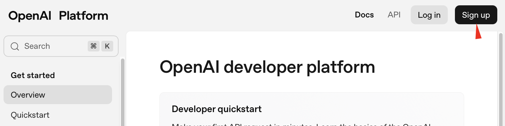
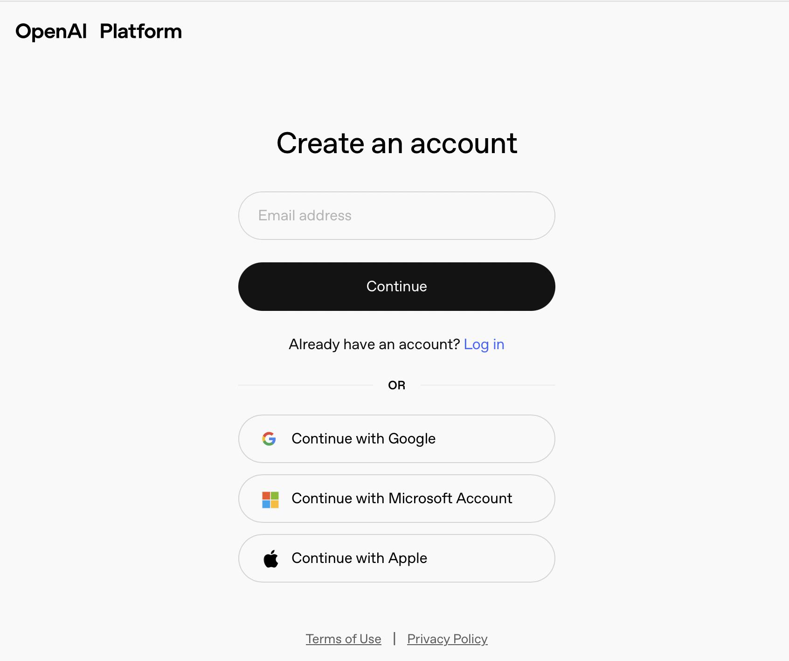
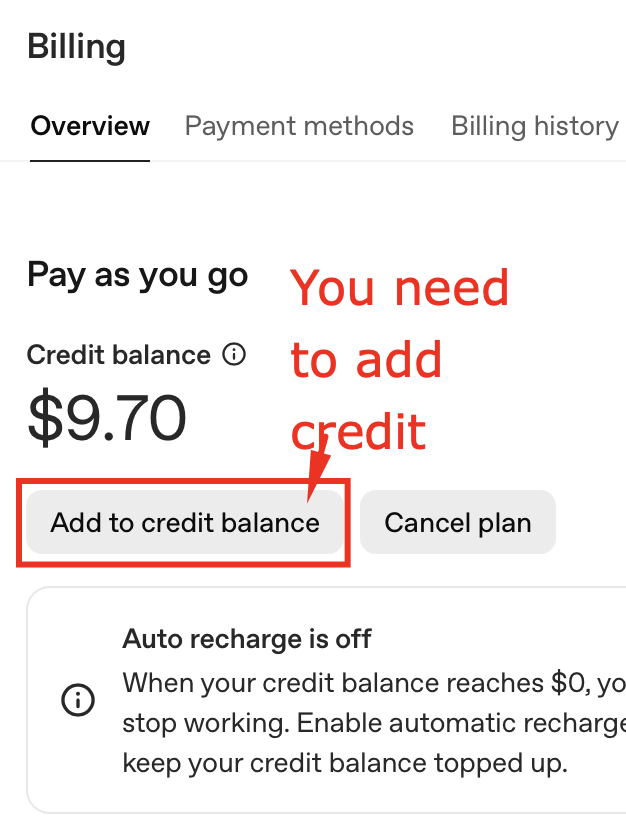
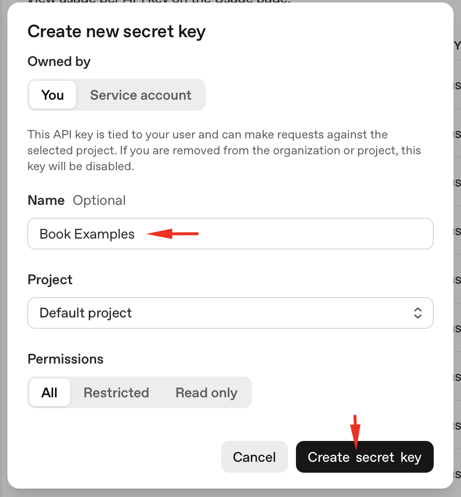
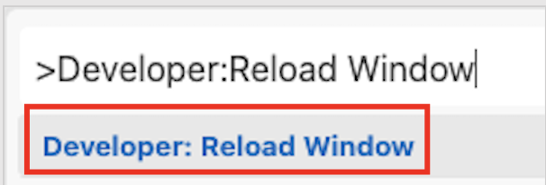
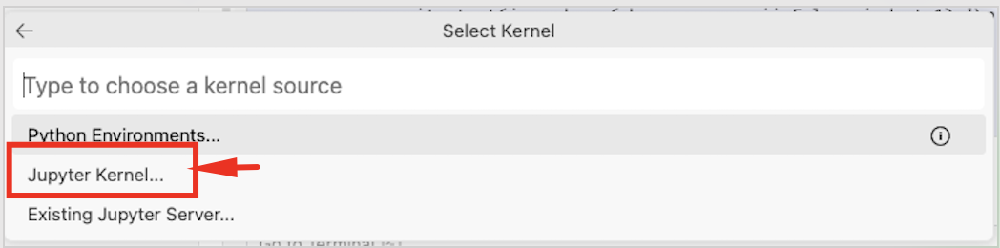
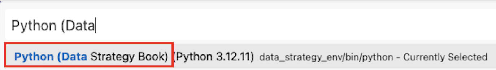
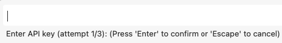

# Data Strategy for LLMs
*Published by Packt*

A comprehensive guide to implementing data strategies for Large Language Models, covering everything from environment setup to advanced RAG implementations.

### OpenAI API Setup

For this book, I'm using OpenAI's API as our primary LLM provider. While there are other excellent options like Anthropic's Claude, Google's Gemini, or even local models with Ollama, OpenAI provides the most reliable, well-documented, and widely-used API in the industry. The reason I choose OpenAI for this book is the predictable service quality, comprehensive model selection, and industry-standard experience that you'll encounter in production environments. However, you can adapt the code to work with any other API of your choice. LLM calls are not the focus of this book, but are necessary. The focus of this book is about the data we are feeding to the LLM.

Here's the step-by-step setup process:

**Step 1: Create Your OpenAI Account**

When you go to https://platform.openai.com, you will see the following screen, where you can Sign In or Sign Up. If you have an account, you just need to sign in. If you don't have account, you need to sign up. Go to https://auth.openai.com/create-account and sign up for an account. You'll need to provide a phone number for verification.


**Figure 1.5: OpenAI Platform homepage - the industry standard for LLM APIs**

**Step 2: Complete Account Verification**

You can sign up with Google, Microsoft, or email. OpenAI requires phone verification for security. I recommend using your primary development account for consistency.



**Figure 1.6: OpenAI registration - phone verification required for account security**

**Step 3: Add Billing Information**

Unlike free-tier services, OpenAI requires a payment method, but you only pay for what you use. The pricing is very reasonable - typically $0.002 per 1K tokens for GPT-4.1. For this book's examples, expect to spend less than $5 total. 

**Important**: **You will have to add money to your credit balance to be able to run the examples in this book. If you did not add credit, you will receive an error when you call the APIs.** 
https://platform.openai.com/settings/organization/billing/overview 



**Figure 1.7: Billing setup - pay-per-use model with transparent pricing**

**Step 4: Navigate to API Keys**

Once your account is set up, go to https://platform.openai.com/api-keys to manage your API keys.


**Figure 1.8: API Keys section in your OpenAI dashboard**

**Step 5: Create Your API Key**

Click "Create new secret key" and give it a descriptive name like "Book Examples" or "Development Testing". 



**Figure 1.9: Creating a new API key**

**Step 6: Copy Your API Key**

Your API key will start with "sk-" - copy the entire string and paste it in the pop-up window in Colab.

- Store it securely. **Important**: You can only view this key once, so save it immediately.

## Quick Start

### 1. API Key Setup (One-time)
```bash
# Copy the template and add your API keys
cp .env.example .env
# Edit .env with your actual API keys (OpenAI, OpenRouter, etc.) with the APIkey you created in the previous step.
```

### 2. Environment Setup (One-time)
**macOS/Linux:**
```bash
bash setup/setup_mac.sh
```

**Windows (PowerShell):**
```powershell
powershell -ExecutionPolicy Bypass -File setup/setup_windows.ps1
```

### 3. Activate Environment
**macOS/Linux:**
```bash
source data_strategy_env/bin/activate
```

**Windows (PowerShell):**
```powershell
.\data_strategy_env\Scripts\Activate.ps1
```

### 4. Use in Jupyter Notebooks
- Select kernel: **"Python (Data Strategy Book)"**
- If kernel not visible: Command Palette → "Developer: Reload Window" (Mac: Cmd+Shift+P, Windows: Ctrl+Shift+P)

- Open Command Palette (Mac: Cmd+Shift+P) (Windows: Ctrl+Shift+P), 
- run: Developer: Reload Window (Mac: Cmd+Shift+P; or press Cmd+P, type '>Developer: Reload Window (Windows: Ctrl+P, type '>Developer: Reload Window')')



- After reload, click Select Kernel (top-right)


- Choose Jupyter Kernel



- Choose `Python (Data Strategy Book)`



- Run ALL cells:


- If you did not add the API key to the .env file, or during the setup, you will receive a pop-up to enter your OpenAI API key



We already explained how to get an OpenAI API key in the first section of this README.

## What Gets Created
- **Shared environment**: `data_strategy_env/` (Python 3.12)
- **Jupyter kernel**: "Python (Data Strategy Book)"
- **API keys**: Loaded automatically from `.env` file
- **All dependencies**: Consolidated across all chapters

## Chapter Structure
Each chapter contains:
- `Jupyter_Notebooks/` - Interactive notebooks
- `README.md` - Chapter-specific instructions
- Supporting data files and resources

## Requirements
- Python 3.12 (automatically installed via setup scripts)
- OpenAI API key (required for most chapters)
- Optional: OpenRouter, Anthropic API keys for advanced features

## Troubleshooting
- **Kernel not showing**: Reload VS Code/Jupyter and reopen notebooks
- **API key errors**: Ensure `.env` file is in repository root with valid keys
- **Import errors**: Verify you're using the "Python (Data Strategy Book)" kernel

## Support
For issues or questions, refer to individual chapter READMEs or the book's official resources.
