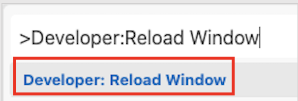
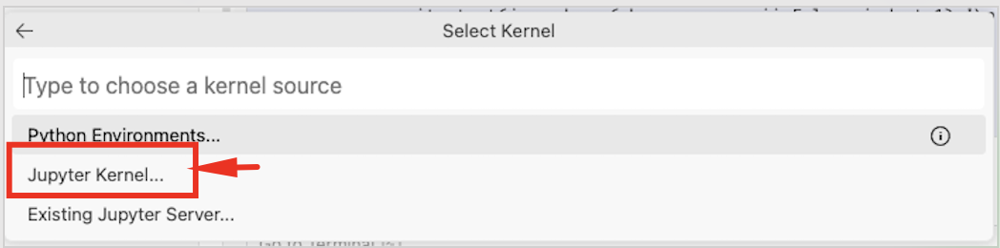
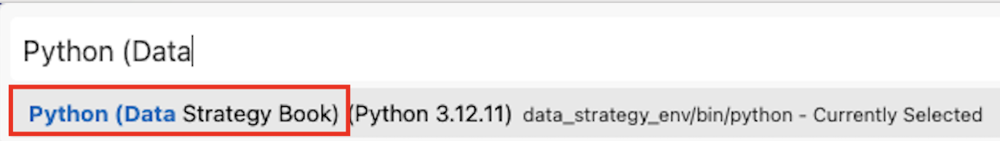
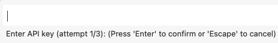

# Chapter 1 — Environment Setup and Notebooks

This chapter uses the book-wide shared environment setup from the repository root.

## Prerequisites

**Complete the book-wide setup first** (from repository root):

macOS/Linux:
```bash
bash setup/setup_mac.sh
```

Windows (PowerShell):
```powershell
powershell -ExecutionPolicy Bypass -File setup/setup_windows.ps1
```

This creates:
- Shared environment: `data_strategy_env/` (Python 3.12)
- Jupyter kernel: "Python (Data Strategy Book)"
- API keys: Automatically configured during setup

## Running the Notebooks

1. **Activate the shared environment**:
   ```bash
   # macOS/Linux
   source data_strategy_env/bin/activate
   
   # Windows (PowerShell)
   .\data_strategy_env\Scripts\Activate.ps1
   ```

2. **Launch Jupyter and select kernel**:
   - Open notebooks in `Jupyter_Notebooks/`
   - Select kernel: **"Python (Data Strategy Book)"**
   - If kernel not visible: Command Palette → "Developer: Reload Window"

## Using the Environment in Notebooks
The setup script registers the environment as a Jupyter kernel named **"Python (Data Strategy Book)"**.
- Open Command Palette (Mac: Cmd+Shift+P) (Windows: Ctrl+Shift+P), 
- run: Developer: Reload Window (Mac: Cmd+Shift+P; or press Cmd+P, type '>Developer: Reload Window (Windows: Ctrl+P, type '>Developer: Reload Window')')



- After reload, click Select Kernel (top-right)


- Choose Jupyter Kernel



- Choose `Python (Data Strategy Book)`



- Run ALL cells:


- If you did not add the API key to the .env file, or during the setup, you will receive a pop-up to enter your OpenAI API key



We already explained how to get an OpenAI API key in the root README.

Quick verification cell inside a notebook:
```python
import sys, pkgutil
print(sys.executable)
print("in data_strategy_env:", "data_strategy_env" in sys.executable)
for m in ["openai", "chromadb"]:
    print(m, "OK" if pkgutil.find_loader(m) else "MISSING")
```
### Troubleshooting: Kernel not showing up
- **Kernel not showing**: Reload VS Code/Jupyter and reopen notebooks
- **API key errors**: Ensure `.env` file is in repository root with valid keys
- **Import errors**: Verify you're using the "Python (Data Strategy Book)" kernel

## Notebooks
- `chapter_01/Jupyter_Notebooks/Chapter_1_Setup_Advanced.ipynb`
- `chapter_01/Jupyter_Notebooks/Chapter_1_Step_By_Step.ipynb`

We recommend selecting the `Python (Chapter 1)` kernel before running cells for a clean, reproducible environment.
